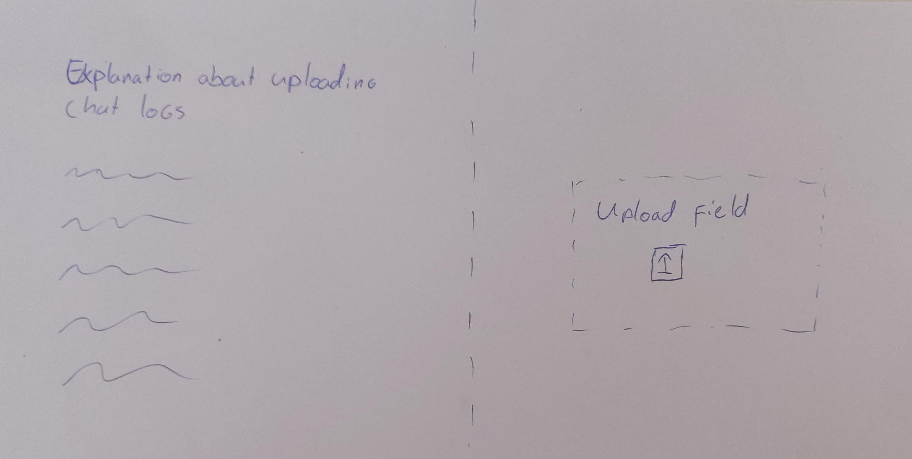
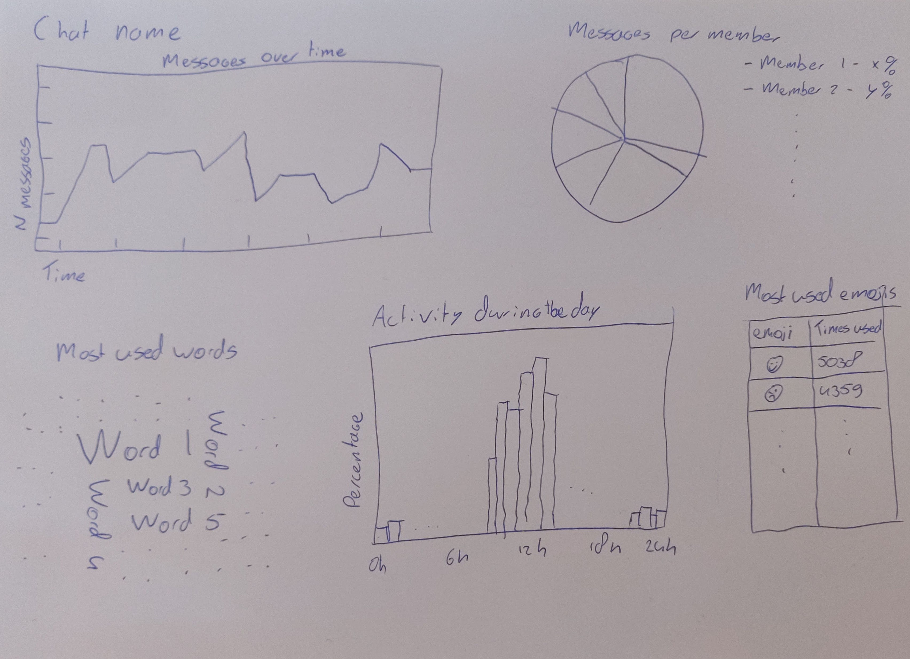
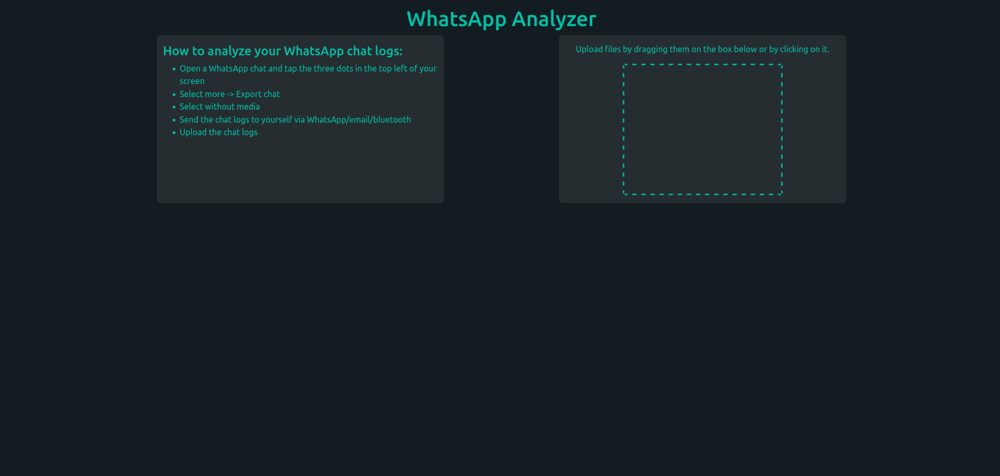
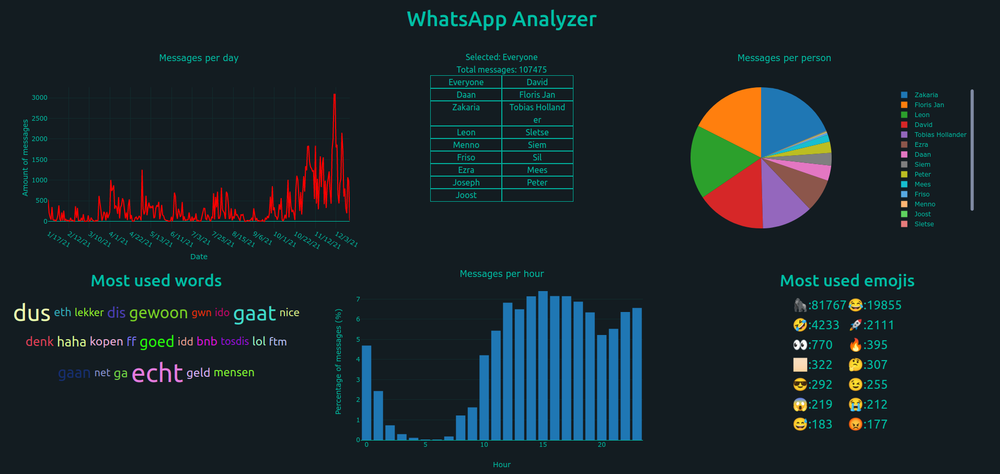

# WhatsApp analyzer
## Peter Voerman
#### 11749547
The WhatsApp analyzer will allow users to upload their own WhatsApp chat logs and provide an analysis of those chat logs.

## Problem
WhatsApp is the most used messaging service in the Netherlands. And while it does allow users to export chat logs, it's currently not possible to extract interesting statistics from these logs. Such statisics could include the amount of messages over time and the most used words in the chat's history. The application could be used by friend groups who want to learn more about what's being said in their chat or by people who own a large group chat to keep track of the activity in their chat over time.

## Solution
This application will allow users to upload their own chat logs and provide them with an analysis of those chat logs. The landing page will consist of an upload button with instructions that explain how users can export their chat logs. After uploading, a second page that shows the analysis will be loaded.

The image above shows a sketch of the upload screen where users can upload their chat logs. The left hand side of the screen will contain an explanation about the exporting and uploading process and the right hand side will contain the field where users can upload their chat logs.


The image above shows a sketch of the analysis users will see after uploading their chat logs. This screen will contain a plot showing the amount of messages over time, a pie chart showing the amount of messages sent per user, a word cloud showing the most used words in the chat, a histogram showing the average activity during a day and a table showing the most used emojis in the chat. Common words like articles will be filtered out from the word cloud.

## Similar apps
- https://chatanalyzer.moritzwolf.com/ also allows users to upload their chat logs and analyzes them. However, it doesn't show the data in a very clear way. It shows the stats per user in a long table users have to scroll through and the graph that's supposed to show the amount of messages over time doesn't work. The upload field does work great, I want to implement it in a similar way.
- https://chatilyzer.com shows most of the data I'm planning to show, but some of the data is shown in a less clear way. It doesn't filter out common words like articles in the word cloud and it shows the amount of messages over time in bins of a month instead of per day, which makes it harder to see busy/quiet days. It does contain a good explanation of how to upload your chat logs.

## Hardest parts
- One of the more difficult parts will be the identifying of words. Not all words will be separated by spaces, so it will be a challenge to think of all the ways a word can be separated.
- Another challenge will probably be the making of the plots using plotly. But after making one, the others will probably be less of a challenge.

## Data
Chat logs can be exported from the WhatsApp application on phones. Users will need to upload their own chat logs. 
Chat logs are .txt files that are formatted like this:
```
5/13/21, 16:07 - Tobias added you
5/13/21, 16:07 - Leon: Goed om te horen
5/13/21, 16:07 - Tobias: kom onze discord
5/13/21, 16:07 - Peter Voerman: Yoo
5/13/21, 16:08 - Daan de Rijk: Hola!
```

## Contents
- `data/` contains three example chat logs
- `doc/` contains the images shown in this readme
- `whatsapp_analyzer/` contains the code of the analyzer

## How to run
- Download this project
- Make sure a recent version of Node is installed
- Install the necessary dependencies (see Acknowledgements)
- Navigate to `whatsapp_analyzer/` in your terminal
- Execute `npm start`

## Acknowledgements
The following external components were used to create the application
- [Plotly](https://plotly.com/javascript/) to make the plots
- [Bootstrap](https://getbootstrap.com/) for CSS
- [Bootstrap-react](https://react-bootstrap.github.io/) for react-specific bootstrap
- [React-tagcloud](https://openbase.com/js/react-tagcloud) to make a word cloud of the most used words
- [stopwords-json](https://github.com/6/stopwords-json) to filter out common words in the word cloud
- [emoji.json](https://www.npmjs.com/package/emoji.json) to filter out emojis

## Screencast
The screencast is uploaded [here](https://www.youtube.com/watch?v=zaslRaOyjM0).

## Screenshots



## License
This project is licensed under the GNU General Public License v3.0 - see the LICENSE.md file for details